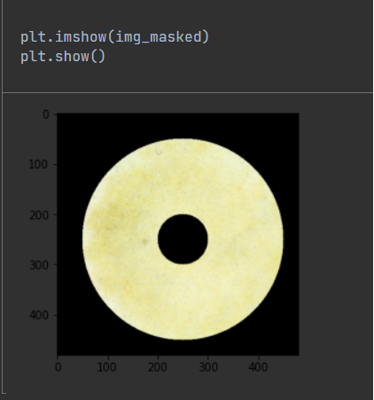
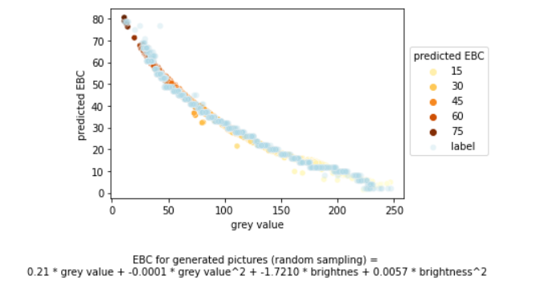
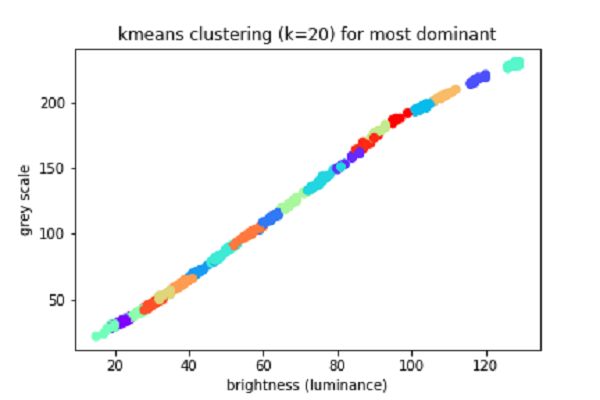
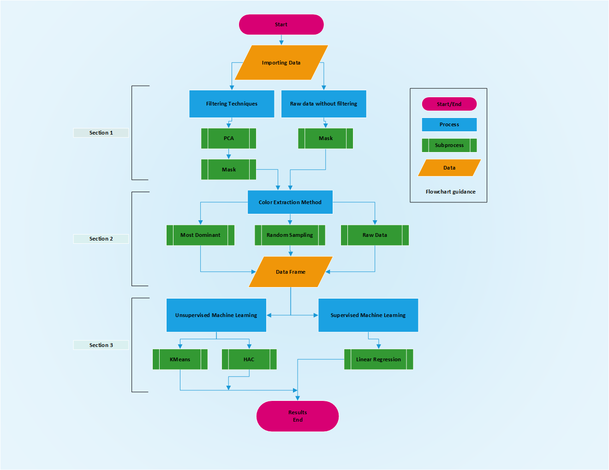

# My-Internship-Project
A feasibility study is conducted to determine whether a device called "Beer-o-meter”, that is specifically developed to measure beer characteristics, can accurately assess the type and quality of beer with the aid of machine learning algorithms. 
SG Papertronic company has developed a device called Beer-o-Meter,  that allows brewers to analyze and measure whether their beer is of good quality or not. This helps them optimize their beer production and lowers their cost. The problem is that the data collected by brewers need to be cleaned up and processed before it can be analyzed.


# Table of Contens
1. [Description](#Description)
2. [Data](#Data)
3. [Installtions](#Installations)
4. [Software](#Software)
5. [Visualizations](#Visualizations)


# Description
Beer is one of the most consumed beverages on the planet. As the technology improves, modern brewing demands high-tech systems for quality and beer type measurements. However, the unavailability and costly lab equipment are abdominal obstacles. To solve the issue, a feasibility study is conducted to determine whether a device called "Beer-o-meter”, that is specifically developed to measure beer characteristics, can accurately assess the type and quality of beer with the aid of machine learning algorithms. The data is provided by SGpapertronics company. The study evaluates image processing and various feature extraction techniques. The use of masking is found to be essential to avoid unnecessary data. Unsupervised machine learning methods and random sampling were not accurate. Image compression “PCA” was applied for dimensionality deduction. The brightness and greyscale features were found to be the most essential values throughout linear regression which is a supervised machine learning algorithm, however, the EBC value needed corrections for brightness configuration that requires further research.
Overall, the study confirms that using computer vision and image processing techniques can be a cost-effective way to improve the efficiency and accuracy of quality control processes for manufacturers and small to medium businesses.

## Data
Data has been collected by SGPapertronics company. 

- Data used in this project comes from a device called Beer-O-Meter which in the developed model of Beer-o-Meter, there is a camera installed which takes photo from some drops of beer on a special paper and the images used in this study are taken by that. The paper contains some enzymes that through some chemical test and measurements the amount alcohol content and other test can be declared. In this case we used only the images to find out about the appearance and type of the beer.  

- Also, due to the lack of data, there was a need to generate and augment data. The sumilated data was generate through image libraries CV2 and image processing which can be be accessed through https://github.com/farimahJl/My-Internship-Project under the Code directory in the Data Augmentation notbook. 
 
 
# Software Requirements
 
All of the code was written in [python 3.10.2] (https://www.python.org/downloads/release/).
The Code Editor was [Jupyterlab 3.4.4]
In addition, several modules were used in order for the code to gain proper functionality. Some packages are default 
packages in python, and these will not be mentioned here. These packages are available in the supplementary materials
in the project paper.

 
| Package                                                             | Version | Usage                                                         |
|---------------------------------------------------------------------|---------|---------------------------------------------------------------|
| [sklearn](https://scikit-learn.org/stable/supervised_learning.html) | 1.0.2   | Used to implement several  machine learning algorithms. Regression,KMeans,HAC Clustering  |
| [scikit-image](https://scikit-learn.org/stable/supervised_learning.html)  | 0.18.3  | Used for image processing, analysis, and computer vision tasks |
| [Numpy](https://numpy.org/)                                         | 1.20.3  | Used for several calculations                                 |
| [seaborn](https://seaborn.pydata.org/whatsnew/v0.12.0.html)         | 0.11.2  | Used for plots visualizations                                 |
| [opencv-contrib-python](https://opencv.org/releases/)               | 4.6.0.66 | Used to read images and transform them into matrixes         |
| [pandas](https://pandas.pydata.org/docs/)                           | 1.4.2   | Used to read data in the Preprocess module                    |
| [pca](https://pypi.org/project/pca/)                                | 1.8.2   | Used to perform pca and construct the scree and bi plot       |
| [pathlib](https://docs.python.org/3/library/pathlib.html)           | 2.3.6   | Used to write constructed plots to file given a specific path |
| [matplotlib](https://matplotlib.org/)                               | 3.5.1   | Used to create a variety of plots                             |


## Installation
Install the packages with either conda or pip.

conda:
```bash
  conda install <PACKAGE>=<VERSION>
```

pip
```bash
  pip install <PACKAGE>==<VERSION>
```

 
# Visualizations
 
 
The use of filtering was found to be essential for this project to redeuce dimentionality and avoid unwanted data. 
 


 
The pipeline produces several plots aimed to find a corelation between different values and predict the beer type measuring the EBCs, Brightness, Grey Values.
Some plots will be shows here and their meanings will be shortly discussed.

The the most promissing is the Linear Regression second order which the variation and EBC prediction is shown as follows:



Due to the fact that the main part of our data was unlabeled The Most dominan color, random sampling, and HAC with the use of KMeans, however, was found to be no value for this project.


 
 
 # Future

To effectively train a machine learning algorithm for beer image analysis, we recommend following established best practices. Start by configuring the device and collecting a sufficient number of beer images with pre-determined EBC values. Use image processing scripts to learn patterns in the samples and generate additional simulated images for data augmentation. Extract relevant features from the beer images using brightness and grey values as independent variables, with known EBC values as the dependent variable. Create a regression equation to predict EBC values based on the features extracted from the beer images. For best results, use a 2nd order model of regression to function the regression equation and predict EBC values for a particular device configuration. Following these steps will improve the accuracy of the predictive model.


# Overview

The flowchart below depicts a schematic overview of the created pipeline.



The flowchart follows standard flowchart symbols with the describtion on it.


# Acknowledgements
I would like to thank my supervisor: Dr. Jasper Bosman and SGPapertronics Company Supervisors Dr. Macej Grajewski & Mr. Richard Rushby, for their guidance during the course of the project. I would like to thank Ms. Fenna Feenstra as my teacher who I got inspiration from her lessons and her Github. 
https://github.com/fenna/

# License
The project contains a MIT [license](LICENSE)


